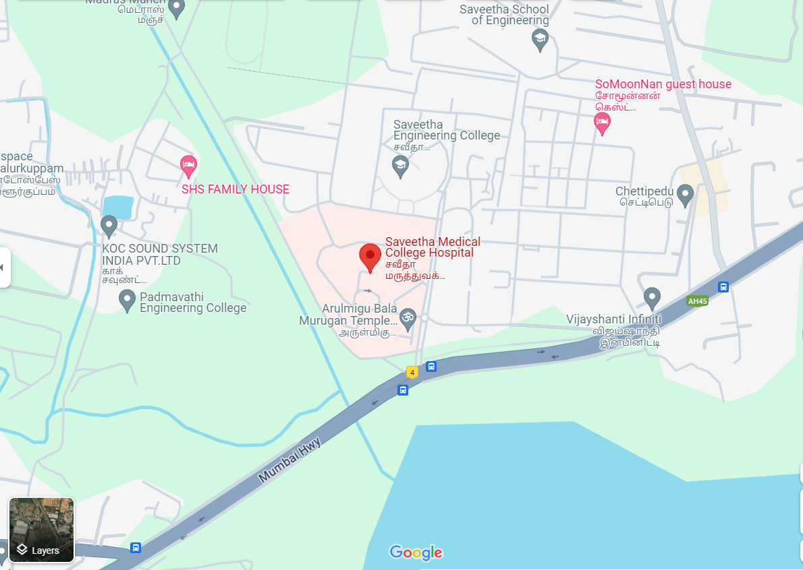

# Ex04 Places Around Me
## Date: 

## AIM
To develop a website to display details about the places around my house.

## DESIGN STEPS

### STEP 1
Create a Django admin interface.

### STEP 2
Download your city map from Google.

### STEP 3
Using ```<map>``` tag name the map.

### STEP 4
Create clickable regions in the image using ```<area>``` tag.

### STEP 5
Write HTML programs for all the regions identified.

### STEP 6
Execute the programs and publish them.

## CODE
```
<!DOCTYPE html>
<html lang="en">
<head>
    <meta charset="UTF-8">
    <meta name="viewport" content="width=device-width, initial-scale=1.0">
    <title>MAP NEAR ME</title>
</head>
<body>
    <h1>MAP NEAR ME...</h1>
    <script>
        function coordinate(event){
            let x=event.clientX;
            let y=event.clientY;
            document.getElementById("text1").value=x;
            document.getElementById("text2").value=y;

        }
    
    </script>
     <br>
    <MAP name="map">
<AREA shape="RECT" coords="492,154,540,190" href="https://www.saveetha.ac.in" title="Saveetha Engineering College">
<AREA shape="RECT" coords="457,295,600,350" href="https://www.saveetha.com/" title="Saveetha Hospitel">
<AREA shape="RECT" coords="149,370,315,400" href="https://padmavatiengineering.com/" title="Padmaavathi Engineering College">
<AREA shape="RECT" coords="700,400,830,440" href="https://www.commonfloor.com/vijayshanthi-infiniti-chennai/povp-0spaby" title="Vijaya shanti Infinite">
<AREA shape="RECT" coords="567,8,700,50" href="https://www.saveetha.com/" title="Saveetha School of Engineering">    
<AREA shape="RECT" coords="128,300,210,340" href="http://www.imoss.co.kr/kor/main/" title="KOC SOUND SYSTEM">  
    </MAP>
    X Co-ordinate <input type="text" name="" id="text1">
    Y Co-ordinate <input type="text" name="" id="text2">
    
</body>
</html>
```

## OUTPUT


## RESULT
The program for implementing image maps using HTML is executed successfully.
